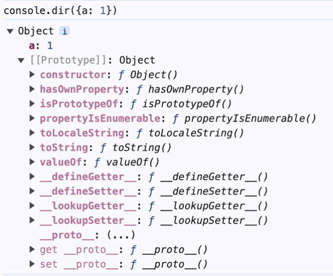
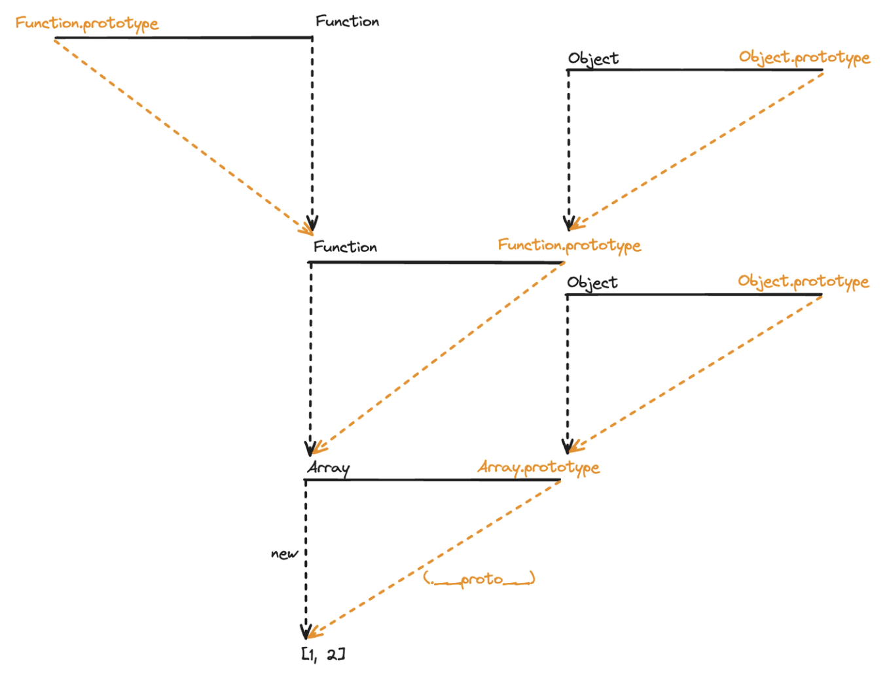
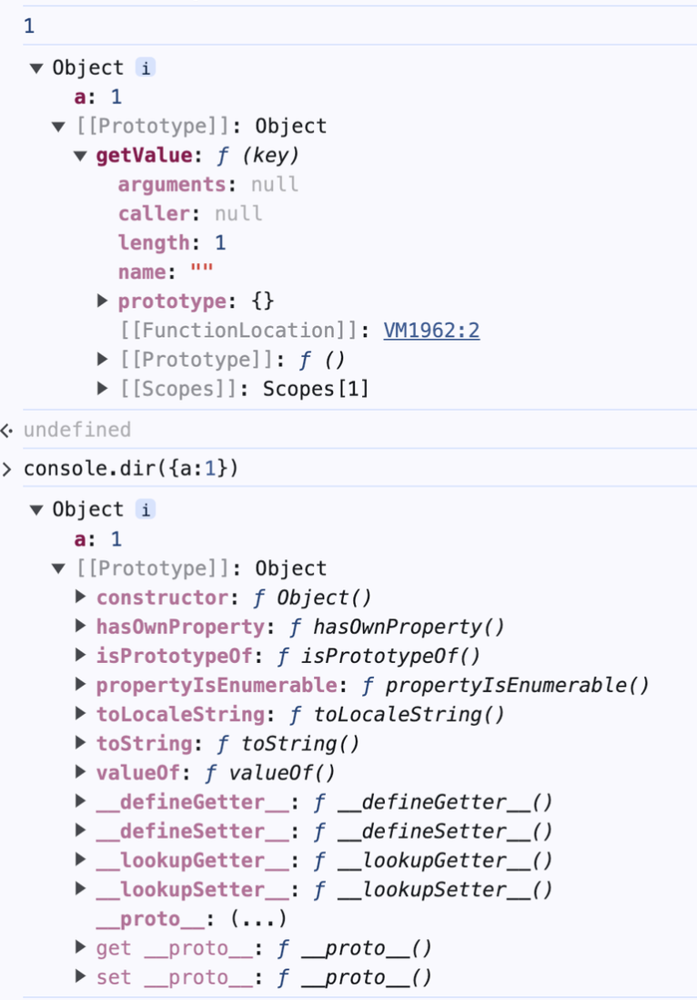
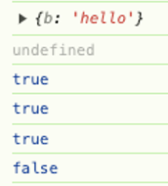

## 02. 프로토타입 체인

### 메서드 오버라이드(property shadowing)

> prototype 객체를 참조하는 `__proto__`를 생략하면 인스턴스는 Prototype에 정의된 프로퍼티나 메서드를 자신의 것처럼 사용할 수 있지만, 만약 인스턴스가 동일한 이름의 프로퍼티 또는 메서드를 가지고 있다면 **인스턴스의 프로퍼티나 메서드가 우선된다.**
> 


💡 **잠시 용어 정리**

- **메서드 오버라이드 :** 인스턴스가 프로토타입 체인에 있는 **동일한 이름의 메서드**를 재정의할 때 발생, 인스턴스의 메서드가 우선됨
- **프로퍼티 섀도잉 :** 인스턴스가 프로토타입 체인에 있는 **동일한 이름의 프로퍼티**를 가질 때 발생, 인스턴스의 프로퍼티가 우선됨

```jsx
var Person = function(name) {    
  this.name = name;
};
Person.prototype.getName = function() {
  return this.name;
};

var iu = new Person('지금');
iu.getName = function() {
  return '바로 ' + this.name;
};

console.log(iu.getName());                // 1.
console.log(iu.__proto__.getName());      // 2.

Person.prototype.name = '이지금';
console.log(iu.__proto__.getName());      // 3. 
console.log(iu.__proto__.getName.call(iu))// 4. 

console.log(iu.name);                     // 5. 
console.log(iu.__proto__.name);           // 6. 
```

```
[iu 객체]
| name: "지금"
| getName: function() { return '바로 ' + this.name; }
|
| __proto__ ------> [Person.prototype]
                    | name: "이지금"
                    | getName: function() { return this.name; }
                    |
                    | __proto__ ------> [Object.prototype]
                                        | ...
```


- **Person 생성자 함수**
    - `Person` 생성자 함수는 `name`이라는 매개변수를 받아서 인스턴스의 `name` 프로퍼티에 할당
        
        ```jsx
        var Person = function(name) {
          this.name = name;
        }
        ```
        
- **Person.prototype.getName 메서드 정의**
    - `Person`의 프로토타입에 `getName` 메서드를 정의 → 인스턴스의 `name` 프로퍼티를 반환
        
        ```jsx
        Person.prototype.getName = function() {
          return this.name;
        };
        ```
        
- **iu 인스턴스 생성**
    - `new Person('지금')`을 호출하여 `iu`라는 새로운 인스턴스를 생성 → 이 인스턴스는 `name` 프로퍼티로 `'지금'`을 가지게 됨
        
        ```jsx
        var iu = new Person('지금');
        ```
        
- **인스턴스의 getName 메서드 재정의**
    - `iu` 인스턴스에 동일한 이름의 `getName` 메서드를 정의 → 이 메서드는 `바로`라는 문자열을 `name` 프로퍼티에 더해서 반환. 이 단계가 바로 **메서드 오버라이딩!!**
        
        ```jsx
        iu.getName = function() {
          return '바로 ' + this.name;
        };
        ```
        
- **iu.getName() 호출**
    - `iu.getName()`을 호출하면, 인스턴스의 `getName` 메서드가 호출됨 → 이 메서드는 인스턴스의 `name` 프로퍼티를 사용하여 `'바로 지금'`을 반환
        
        ```jsx
        console.log(iu.getName()); // 바로 지금
        ```
        

### 프로토타입 체인

> 객체의 프로퍼티에 접근하려 할 때 해당 객체에 접근하려는 프로퍼티가 없다면 `__proto__` 프로퍼티 내부 참조를 따라 연쇄적으로 검색하는 것을 프로토타입 체이닝이라 함. (연쇄적으로 이어진 것은 체인)
> 
> 
> 자바스크립트가 객체지향 프로그래밍의 상속을 구현하는 메커니즘
> 

```jsx
var arr = [1, 2];

Array.prototype.toString.call(arr); // 1,2 
Object.prototype.toString.call(arr); // [object Array]
arr.toString(); // 1,2

arr.toString = function() {
  return this.join('_');
};
arr.toString(); // 1_2
```

```jsx
[1, 2] (배열 인스턴스)
|
| __proto__ ------> Array.prototype
                    | concat()
                    | push()
                    | pop()
                    | slice()
                    | toString()
                    |
                    | __proto__ ------> Object.prototype
                                        | toString()
                                        | hasOwnProperty()
                                        | valueOf()
                                        | ...
                                        |
                                        | __proto__ ------> null
```

1. arr 변수는 배열이므로 arr.__proto는 Array.prototype을 참조하고, Array.prototype은 객체이므로 Array.prototype.__proto__는 Object.prototype을 참조할 것이다. 
2. toString이라는 이름을 가진 메서드는 Array.prototype뿐 아니라 Object.prototype에도 존재한다.



3. 메서드 오버라이딩과 프로토타입 체이닝으로 인해 각각 가까운 프로퍼티(메서드)가 출력되는 것을 볼 수 있다.

> 접근 가능한 모든 경우 표기시…
> 



> 모든 객체는 **각 방식마다 세부적인 객체 생성 방식의** 차이는 있으나 **추상 연산 OrdinaryObjectCreate에 의해 생성된다는 공통점**이 있다. - from. 딥다이브
> 
- **객체 생성 방식**
    
    ```jsx
    // 1. 객체리터럴
    let obj = {} 
    
    // 2. new Object 오브젝트 생성자
    let conobj = new Object() 
    
    // 3. 클래스 문법을 활용
    class Hi { 
        constructor(name) {
            name = this.name
        }
    } 
    
    // 4. Object.create()메서드 사용
    let obj3 = Object.create(null) 
    
    // 5. 생성자 함수를 이용
    function hello(name){ 
        this.name = name
    }
    let hel = new hello('judy')
    ```
    

추상 연산 **OrdinaryObjectCreate**는 필수적으로 자신이 생성할 객체의 프로토타입을 인수로 전달받는다. 그리고 추가 옵션으로 생성할 객체에 추가할 프로퍼티 목록도 전달 받을 수 있다.

이러한 OrdinaryObjectCreate는 다음과 같이 동작한다.


1. 빈 객체를 생성한다.
2. 인수로 전달된 프로퍼티가 있으면 이를 객체에 추가한다.
3. 인수로 전달받은 프로토타입을 생성한 객체의 [[Prototype]]내부 슬롯에 할당하여 객체를 반환한다.
    - 사용자 정의 생성자 함수일 경우 → prototype 프로퍼티에 바인딩 되어있는 객체 할당
    - **객체 리터럴**, Object 생성자 함수 → Object.prototype 할당
        - **객체 리터럴로 생성한 객체** → 가상적인 생성자 함수를 가지게 됨 → 생성자 함수의 짝궁인 프로토타입이 생성됨 → prototype, constructor프로퍼티에 의해 연결되어 있기 때문

**즉, 프로토타입은 추상 연산 OrdinaryObjectCreate 에 의해 전달되는 인수에 의해 결정되지만, 내부적으로는 평범 객체 생성을 호출하여 부모 프로토타입을 Object.prototype으로 가지게 한다는 것!**

[참고]
https://east-star.tistory.com/4
https://xionwcfm.tistory.com/187#😎OrdinaryObjectCreate-1
https://ko.javascript.info/constructor-new

```jsx
// 생성자 함수로 객체 생성
const obj = new Object();
const func = new Function('x', 'y', 'return x + y');

// obj.consturctor는 Object생성자 함수를 가리킴
console.log(obj.constructor === Object); // true
console.log(func.constructor === Function); // true

// 리터럴 표기법으로 객체 생성
const obj2 = {};
function func2() {};

console.log(obj2.constructor === Object); // true
console.log(func2.constructor === Function); // true
```


### 객체 전용 메서드의 예외사항

**객체에서만 사용할 메서드들은 프로토타입 객체(Object.prototype)에 정의할 수 없다. 그 이유는 다음과 같다**

> 객체에서만 사용할 메서드를 Object.prototype내부에 정의한다면 다른 데이터 타입도 해당 메서드를 사용할 수 있게 되기 때문
> 

```jsx
Object.prototype.getEntries = function() {
  var res = [];
  for (var prop in this) {
    if (this.hasOwnProperty(prop)) {
      res.push([prop, this[prop]]);
    }
  }
  return res;
};

var data = [
  ['object', { a: 1, b: 2, c: 3 }], // [["a",1], ["b", 2], ["c",3]]
  ['number', 345], // []
  ['string', 'abc'], // [["0","a"], ["1","b"], ["2","c"]]
  ['boolean', false], // []
  ['func', function() {}], // []
  ['array', [1, 2, 3]], // [["0", 1], ["1", 2], ["2", 3]]
];
data.forEach(function(datum) {
  console.log(datum[1].getEntries());
});
```

그렇기에, 객체만을 대상으로 동작하는 객체 전용 메서드들은 부득이 Object.prototype이 아닌 Object에 static method(https://medium.com/@massoud-sharifi/object-static-methods-javascript-4444af635a9f)로 부여할 수밖에 없다.

> 또한 **생성자 함수인 Object와 인스턴스인 객체 리터럴 사이에는 this를 통한 연결이 불가능**하기 때문에 여느 전용 메서드처럼 메서드명 앞의 대상이 곧 this가 되는 방식 대신 this의 사용을 포기하고 **대상 인스턴스를 인자로 직접 주입**해야 하는 방식으로 구현돼 있다.
> 

만약 객체 전용 메서드들도 다른 데이터 타입처럼 인스턴스 메서드로 정의할 수 있었다면 문법이 이렇게 되었을 것

- `Object.freeze(instance)` 대신 `instance.freeze()`
- `Object.getPrototypeOf(instance)` 대신 `instance.getPrototype()`

💡 Object.create(null)는 __proto__가 없는 객체를 생성한다. 내장 객체 제거됨으로 기본 기능에 제약이 생기지만 성능상 이점을 가진다.

```jsx
var _proto = Object.create(null)
_proto.getValue = function(key) {
	return this[key]
}
var obj = Object.create(_proto)
obj.a = 1
console.log(obj.getValue('a')) // 1
console.dir(obj)
```



💡 **hasOwnProperty vs hasOwn**

```jsx
const a = Object.create(null)
// __proto__가 없는 객체를 생성
a.b = "hello"
console.log(a)
console.log(a.__proto__)

a.hasOwnProperty = function() {
    return true
}

// 메서드 오버라이드
console.log(a.hasOwnProperty("b"))         // true
console.log(a.hasOwnProperty("notExist"))  // true

// ECMAScript 2022(ES13)에서 추가된 메서드 hasOwn, 정적 메서드
console.log(Object.hasOwn(a, "b"))         // true 
console.log(Object.hasOwn(a, "noExist"))   // false
```




### 다중 프로토타입 체인

대각선의 __proto__를 연결하는 방법은 __proto__가 가리키는 대상, 즉 생성자 함수의 prototype이 연결하고자 하는 상위 생성자 함수의 인스턴스를 바라보게끔 해주면 된다.

```jsx
var Grade = function() {
  var args = Array.prototype.slice.call(arguments);
  for (var i = 0; i < args.length; i++) {
    this[i] = args[i];
  }
  this.length = args.length;
};
var g = new Grade(100, 80);
Grade.prototype = [];

console.log(g)    // Grade(2) [100, 80]
g.pop()
console.log(g)    // Grade(1) [100]
g.push(90)
console.log(g)    // Grade(2)  [100, 90]
```

책에선 Grade 생성자 함수의 프로토타입을 배열로 설정하여 Grade인스턴스가 배열의 메서드를 상속받도록 하여 인스턴스에서 배열 메서드를 직접 쓸 수 있게 하였다. 

- `Grade` 생성자 함수는 가변 인자를 받아 각 인자를 인덱스 프로퍼티에 할당하고 `length` 프로퍼티를 설정한다.
- `Grade.prototype`을 배열로 설정하여 `Grade` 인스턴스가 배열의 메서드를 상속받도록 한다.
- 이를 통해 `Grade` 인스턴스가 배열처럼 동작하며, `pop`과 `push`와 같은 배열 메서드를 사용할 수 있다.


g 인스턴스 입장에서는 프로토타입 체인에 따라 g객체 자신이 지니는 멤버, Grade의 prototype에 있는 멤버, Array.prototype에 있는 멤버, 끝으로 Object.prototype에 있는 멤버까지 접근할 수 있다.
